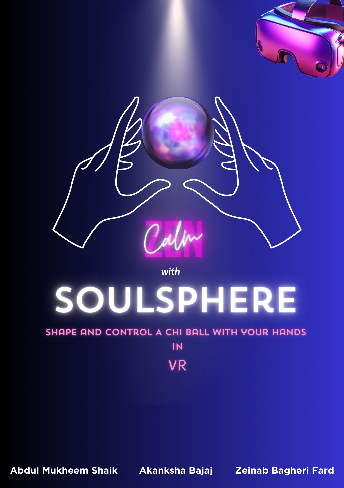
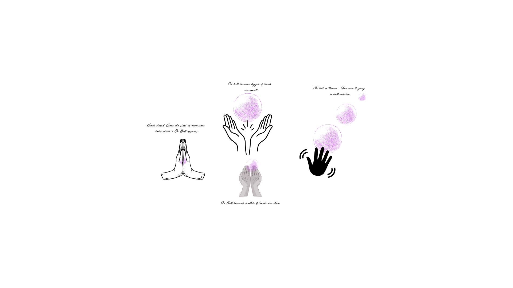
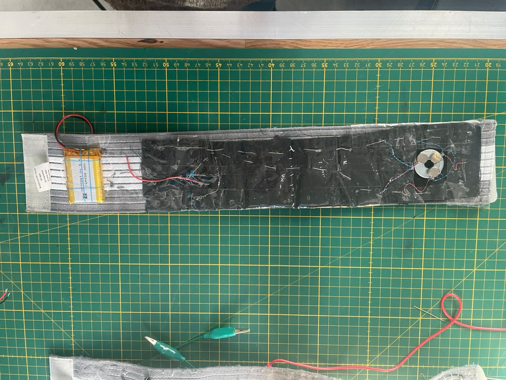

# testfolder

![test1]
![test2]
![test3]

<!-- Place this file at the root of your Unity project.
At the same level than the folders Assets/* -->

# SoulSphere

### Introduction
***SoulSphere*** is a learning VR experience focused on providing a user a guided calming experience catalysed by immersive audio narration and tangible feedback to embark on a journey of **visualisation** and **intention-setting** where they can use their hands to visualise an energy ball called a CHI ball. The hand gestures will be able to change the size of the CHI ball.The experience gives the user tangible feedback at various points within the creation of CHI Ball to make it more interactive and immersive. The tangible feedback and its components are discussed below in the Design Process.

**The concept of Chi**
The concept of CHI dates back to ancient chinese energy practices like Qi gong and Tai Chi. Chi referes to the " vital life force" that flows through all beings. The chi ball represents a concentrated form of this energy, visualized or physically created through specific hand movements. Over time, the concept of the chi ball has been adapted and incorporated into various cultures and meditation practices.

***SoulSphere offers the following to you***
- **Visualization Practice**
SoulSphere offers guided visualization for creating a chi ball, promoting mindfulness through intentional imagery.

- **Mind-Body Connection**
Synchronizes physical movement of hands with mental imagery, enhances proprioceptive awareness and sensory perception.

- **Empowering Tool**
The chi ball can be infused with positive intentions, empowering users to align thoughts and actions with personal goals.

- **Daily Ritual buidling**
Incorporating chi ball creation into daily routines fosters mindfulness, self-awareness, and a sense of inner peace.

- **Promotes Calmness**
Chi ball practice helps in achieving calmness by promoting relaxation through focused energy manipulation and being in the present moment.

##### WHY SOULSPHERE IS NEEDED ?  

###### Reconnect with oneself:
In a fast-paced world, self-care often takes a backseat. Chi ball practice serves as a crucial reminder to prioritize well-being, providing a sanctuary of calmness and inner peace amid hectic schedules.

###### Diverse Visualization Methods:
To cater to individuals who may not resonate with traditional visualization methods like meditation or guided imagery, SoulSphere aims to offers a visualization techniques. Soulsphere offers  sensory-based experiences,calming narratives, tactile feedback, and interactive element to engage users who have varying preferences and sensory profiles. By providing multiple pathways for visualization, SoulSphere ensures inclusivity and accessibility for a broader audience.

###### Aphantasia-Friendly:
Understanding the challenges faced by individuals with Aphantasia, SoulSphere implements features specifically designed to accommodate their needs. Rather than relying solely on mental imagery, Souplphere incorporates alternative modes of engagement, such as auditory cues, tactile sensations, and kinesthetic interactions. By offering multi-sensory experiences, SoulSphere enables users with Aphantasia to participate fully in the visualization process, alleviating frustration and promoting a sense of empowerment and inclusion.

The proposed solution is viable because Soulsphere offers a degree of realism.Seeing the creation made by the user themselves in Virtual Reality and by shaping the sphere with hands in real world will help them focus on their mind. Soulsphere also offers elements of tactile feedback and the feeling of warmh in hands that enhances the sensory experience and promotes user engagement.The learning experience revolves around practicing this exercise of visualisation that instantly calms the mind and instils a drive of positiveness.SoulSphere aims to eliminate the frustration arising from inability to visualise.

## Design Process
- Group Discussion : As a group, we brainstormed on how we can give a calming experience to a user so that they can learn and later incorporate a practice in their day to day life. Many people don't engage in calming practices due to busy schedules, misconceptions about their effectiveness or difficulties and a preference for instant gratification or digital distractions. Thats when Chi ball came to picture.We read more about the Chi and creation of CHI ball with its  calming effects.We all agreed that incorporating this ancient technique with latest VR technology that will help users visualise will have an positive impact on them.We discussed the basic idea if it would be a sitting experience or an experience where user has to lie down. We gravitated towards a sitting experience keeping in mind the comfort of the user.Also, we sketched our vision.

 
- Storyline :We discussed various aspects of the project, starting from the beginning-how the experience would start. We thought we would start the experience in VR but upon realising how calmness plays a pivotal role here, we wanted the user to be settled comfortably in a chair, then wear a headset. Before starting the experience, we decided to make sure that the user doesnt have a blurry vision or inapt IPD(Inter Pupillary Distance) that's common if you do not adjust the VR headset properly.While brainstorming, we didn't know how we would gauge that if the user is settled to start the exprience. We made a decision here.To achieve this, we asked an input from the user which was a thumbsup gesture which is intutitive when one is ready and we displayed this in front of the user. We chose mixed reality here because while introducing abstract or unfamiliar concepts like Chi, while maintaining a sense of grounding in their physical reality.Once the gesture is recognised, the UNITY triggers the audio video of the background knowledge about what is CHI and a Chi ball.Also the basis of any calming practice is to gradually shift a user from real world to another world of calmess. So the shift from MR to VR comes in the next stage. As a group we discussed about every stage to make the user comfortable and the experience calming.

- Transition: Now the question was how would we transition the user from the real world to the world of VR.This is because while MR provides a blended experience of the physical and virtual worlds, transitioning to VR allowed the user to a fully immersive environment dedicated solely to the Chi ball creation experience. Our initial plan was to make user touch a table by keeping hands on it and then the user will slowly transport via a portal which was designed by essentially the darkening of the screen.The need of tangible element here was required to make the transition from MR to VR more impactful.We decided to have a touch by incorporating a touch sensor. But after discussing it with our mentors, we realised touching was not enough.Some kind of feedback was necessary to add to the whole experience of transitioning. We added a heatpad enclosed in a cloth which the user is suppose to touch. As the hands get warm, the user enters the world of VR from the real world. This cloth has a circuit inside it which consists of a touch sensor, heatpad, mosfet connected to ESP 32.  The circuit diagram for heatpad is shown below.

- Development of the idea : We built upon this idea more after our initial plan was in place. We decided how the energy ball would look like in VR. We discussed about a simple black universe secene with twinkling stars in UNITY.Once the user is in VR, the audio narration guided them to create a CHI ball. We decided that the hand tracking would help the user to change the size of the ball. We then planned how the experience would come towards an end. In most of CHi ball creation practices, the practitioner releases the ball in universe. Taking inspiration from that, we decided that the user will do the gesture of throw and send the CHI ball in the universe.

- Ending the experience: While ending the experience, we thought that to give the subtle feeling of being energised after releasing the CHI ball, we would add a feeling of vibration to the user's wrist as soon as the ball is thrown. But attaching a circuit to the user's wrist that consists of wires was a challenge to us.We decided to achieve this by sewing a circuit on a wristband that consists of The Adafruit Circuit Playground Express (CPX) that also features an infrared (IR) transmitter and receiver, which allows it to send and receive infrared signals.This was challenging but made the wrist band mess free and automated.This eliminated the need of the wired circuit and as soon as the user did the throw gesture, the sendor and reciever comminicated and the vibration was activated.Not only this while throwing, we decided to design the ball go away leaving a trail and still glowing while giving an enhanced visual experience to the user.

- User Personna : We have two categories of Users- A and B. Our target user A is anyone who is ready to explore calmness and learn techniques to prioritize mental wellbeing and is open to integrate mindfulness into their daily routine.The user feels that the traditional methods are not that engaging. The user feels that most of the traditional practices also focus on the present moment without actually adding anything extra. Our target user B is someone who are not able to visualise.With regular guided meditations, it becomes frustraing for the user B to imagine or visualise something. User B may struggle to fully engage with these practices. This can lead to feelings of frustration, as they may feel excluded from certain mindfulness activities or unable to reap the same benefits as those who can visualize easily. A typical user whether A or B  of this app can have a varying level of familiarity of concepts like CHI and can range from novice to experienced practitioners.The user A and B are in need of a calming practice for stress reilef that is easy,immersive has an interactive and engaging experience coupled with innovative technology that can enhance the overral experience and can be incorporated in daily schedule. 

***SOULSPHERE*** addresses the above needs and is designed in a way to offer an immersive experience to the user. With tangible elements and transition from MR to VR, it makes the mindfulness journey more interactive.Also, it bridges this gap by providing alternative methods for relaxation and stress relief that don't rely solely on mental imagery. It incorporates tactile sensations, auditory cues, and interactive elements to engage users on multiple levels. The blended narration also encourgaes them to incorporate this in daily life.

- User Journey : The different stages of User Journey are classified as
              - User becomes aware of SoulSphere through different social media platforms
              - The user is intrigued to try SoulSphere and makes the decision to access it.
              - The user launches the VR app and begins the mindfulness session
              - The user learns about a new technique to calm themselves
              - The user interacts with various tangible elements of the app.
              - The user plays and maipulates the shape of CHI ball with their hands
              - The user finds SoulSphere to be relaxing and immersive with audio, video and sensory feedback.
              -The user is satisfied with the experience and now plans to incorporate this practice in their day to day life

              
The following video shows the whole SoulSphere experience.

### System Description
#### Features

SoulSphere offers an immersive experience of creation of a 3D CHI Ball in a calming environment.Following are the features that have been incorporated to make the user experience calming and engaging.

***An Immersive Virtual Experience with a hint of MR**
The MR environments is meticulously designed to provide users with comfort and the VR environment is designed for a deeply immersive and engaging experience. 

**Hand-tracking and Pose Detection**
Utilizing advanced hand-tracking technology and hand pose detection with the Oculus Interaction SDK, users can interact with the virtual environment using intuitive hand gestures. This includes gestures like thumbs up to confirm actions ,changing the size of CHi ball by bringing the hands closer and farther and releasing the CHI ball by throwing gesture,

**Interactive Tangible Interactions**
The experience goes beyond traditional hand gestures by incorporating interactive tangible interactions. Users can physically touch objects to feel heat sensations through heat pads, and even experience haptic feedback through DC motors controlled by an ESP32-S2 microcontroller at various stages of the experience. These tangible interactions enhance the sense of presence and immersion in the virtual environment.

**Voice-over Narration**
Throughout the experience, users are guided by immersive voice-over narration. This narration serves as a companion, providing instructions, insights, and calming guidance as users navigate through the process of creating a 3D Chi Ball.

**Integration with Unity and XR Plug-in Management**
The experience is built using Unity and seamlessly integrates with XR Plug-in Management for compatibility across different VR platforms. This ensures a smooth and optimized experience for users regardless of their VR device.

**Oculus Compatibility**:
The experience is optimized for Oculus devices, with support for Quest 2, Quest 3, and Quest Pro. Leveraging the capabilities of Oculus VR headsets, users can enjoy high-quality visuals, responsive tracking, and comfortable VR experiences.

#### Installation
The following steps will help you in seamless installation of the app.

**1)Installing Unity Hub**
Download Unity Hub from the official Unity website and install it on your computer.
Launch Unity Hub once the installation is complete.

**2) Installing Unity Editor and Required Modules**

 -Open Unity Hub and navigate to the 'Installs' tab.
-Click on the 'Add' button to install a new version of Unity Editor.
-Select the recommended Unity Editor LTS version 2022.3.Xf1 or higher.
-During installation, make sure to include the following modules:
- Microsoft Visual Studio IDE (for code editing).
- Android Build Support (libraries required for Android VR development).
- Follow the on-screen instructions to complete the Unity Editor installation.

**3) Configuring Your Unity Project for Android VR**
- Create a new Unity project from the 'Projects' tab in Unity Hub.
- Choose the 3D (URP) template, name your project, and select a location to save it.
- Switch the build platform to Android:
- Open your project in Unity.
- Go to File > Build Settings and select 'Android' as the target platform. Click 'Switch Platform' to confirm.
- Import the Meta XR SDK:
- Navigate to Window > Package Manager.
- Click the '+' icon and select 'Add package by name'.
- Enter 'com.meta.xr.sdk.all' and click 'Add'. Restart Unity if prompted.
- Configure Unity for XR development:
- Access Project Settings and navigate to the 'Oculus' option in the left menu.
- Click 'Fix All' to apply the necessary settings for VR development.
- Under 'XR Plug-in Management' in Project Settings, ensure that 'Oculus' is checked for the Android platform.

**4)Building Your XR App**
- With your project configured, go to File > Build Settings.
- Ensure that the Android platform is selected, and your scene is included in the build.
- Click 'Build' and choose a name and location for the generated APK file.

| Platform | Device | Requirements | Commands |
| -------- | ------ | ------------ | -------- |
| Windows  | Meta Quest   | Unity 2022.3 or higher, Arduino | `git clone https://github.com/user/repo.git` `cd project-xr` `open MainScene.unity` `Build and Run` |

## Usage

 SoulSphere has been designed to keep the interactions intutive as well as the audio guided narration makes the learning experience more comfortable. Not only this, at various stages of the learning experience , visual affordances are added to cater to all kind of learners- whether visual or auditory.
 
***1. Wearing the Headset***: Put on the VR headset and be ready to experience the world of calmness

**2 Learning about CHI***: As you get comfortable on the chair, you learn about CHI in Mixed Reality through audio video cues.

***3. Entering Visualization Mode***: To enter the world of visualization, place your palm on a designated cloth kept in front of you. This gives a heat feedback to your hands making it warm. This action serves as the trigger to initiate the visualization experience.

***4. Creating the Chi Ball***: Once in visualization mode, position your hands at a comfortable distance from each other to begin visualizing the chi ball in VR. You'll start to see the virtual representation of the chi ball forming between your hands.

***5. Adjusting Size***: To change the size of the chi ball, move your hands closer together to shrink it or farther apart to expand it. The virtual chi ball will dynamically adjust its size based on the real-life movements of your hands.

***6. Narrative Guidance***: Throughout the experience, listen to narrations that provide guidance at every step of the process. These narrations offer instructions and insights to enhance your understanding and engagement with the visualization exercise.

***7. Finalizing and Sending***: After you're satisfied with the size and shape of the chi ball you've created, it's time to finalize your visualization. Use a throwing movement within the VR environment to send the chi ball either out into the universe or to yourself, symbolizing the act of manifesting your intentions. At this point, you also experience subtle vibrations around your wrist

Some tips, tricks, and best practices for using SoulSphere effectively:

- Tip 1 Start the experience only when you are confortably settled.
- Tip 2 Pay attention to the audio and video cues.

## References
https://www.researchgate.net/publication/352117093_Science_in_Qi

## Contributors
The authors of the project, contact information, and links to their websites or portfolios.

[Abdul Mukheem Shaik](https://www.linkedin.com/in/abdul-mukheem-shaik?utm_source=share&utm_campaign=share_via&utm_content=profile&utm_medium=android_app)
[Akanksha Bajaj](https://www.linkedin.com/in/akanksha-bajaj-a3638a32)
[Zeinab Bagheri Fard](https://www.linkedin.com/in/zeinab-bagherifard-b6458b272/)
